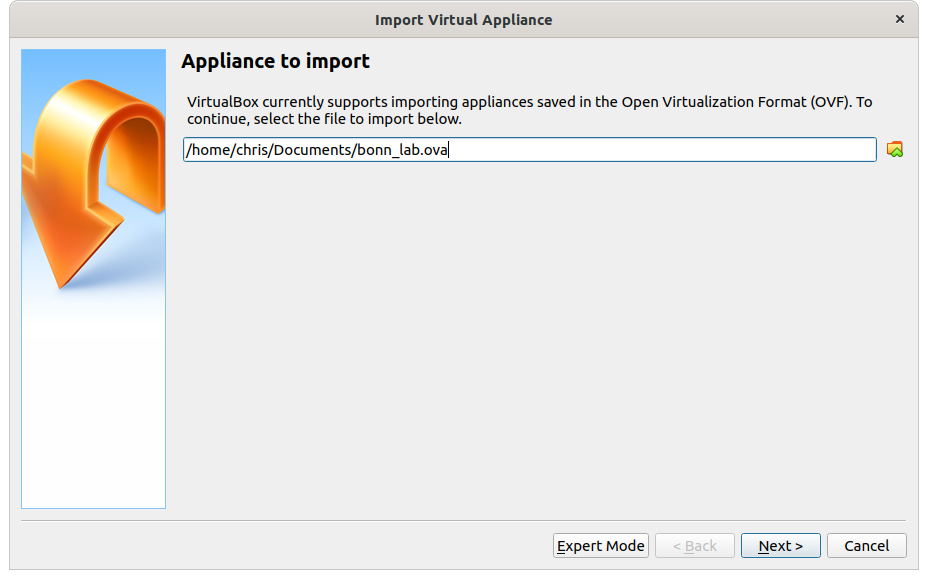

# Instructions for remote laboratory courses (ATLAS & Z0)

## Running the analysis software

People should ensure that everything works roughly a week in advance.

### Option 1: X-forwarding

Need instructions for linux-based, MacOS and Windows systems.

Linux: Should be straightforward.

MacOS: Install XQuartz?

Windows: ???

### Option 2: Virtual Machine

You can use a virtual machine (VM) as an alternative in case X-forwarding does
not work for you or your internet connection is too slow. We provide an
preconfigured 'appliance' that you can run using
[VirtualBox](https://www.virtualbox.org/). Please note that running a VM
requires a decent computer (and quite some disk space) therefore we suggest that
you try X-forwarding first but feel free to use this method if you have prior
experience with VMs.

To run the appliance need to download VirtualBox and install it on your
computer. VirtualBox is available for all major operating systems (e.g. Windows,
OS X, and Linux) on the [VirtualBox Downloads
page](https://www.virtualbox.org/wiki/Downloads).

You can download the ATLAS & Z0 appliance [here (4.6
GB)](https://uni-bonn.sciebo.de/s/t3IsIU8bMMWik7Q).

#### Setting up the appliance

The following instructions have been tested with VirtualBox 6.0.14 on a Linux
system. Some things might be named a little differently if you are running a
different version or operating system.

1. Start VirtualBox and go to `File > Import Appliance`
2. Select the appliance in `OVF` format that you downloaded from sciebo and click `Next`
3. The next window gives you the option to change the appliance settings. The
   defaults should be fine to use for the lab. Note that you can also change the
   directory where the VM is stored. Click `Import` after you are done changing
   the settings.
4. The appliance will show up in the VirtualBox Manager. Select it and press `Start`.
5. A window will show up with the graphical output of the VM.

#### Getting data off the VM

You can use any online file sharing service (e.g. sciebo, e-mail, ...) to get
the data you need for the report off the VM.

## Collaborating with your lab partner

Ways to talk & share your screen:
* DFN [link](https://www.conf.dfn.de/)
* Skype

## Oral exam

Ways to sketch things (anything goes really, just some recommendations):
* [Xournal++](https://github.com/xournalpp/xournalpp)
* Paint?

##
