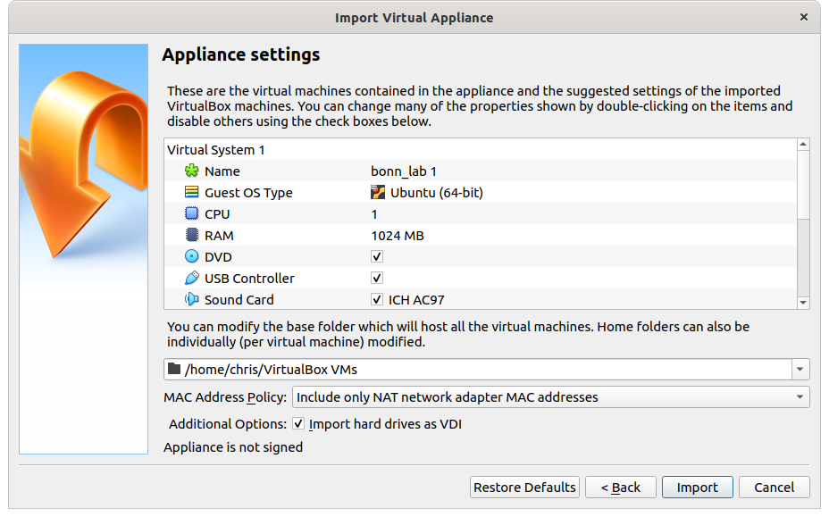
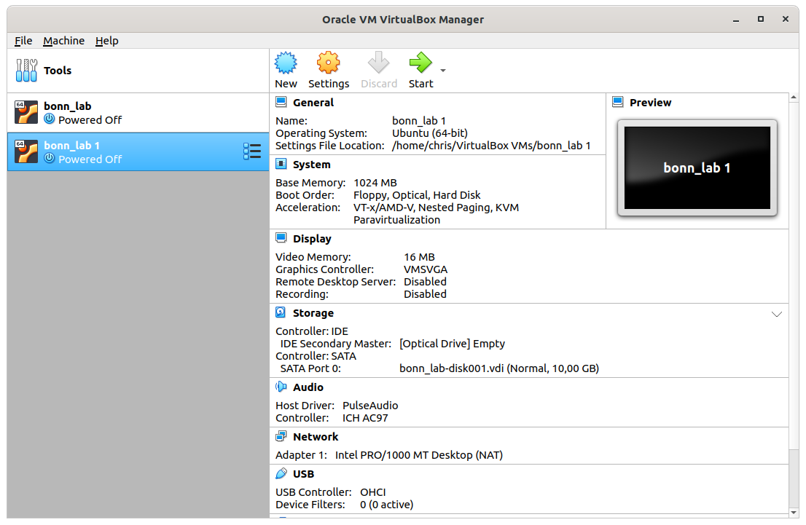
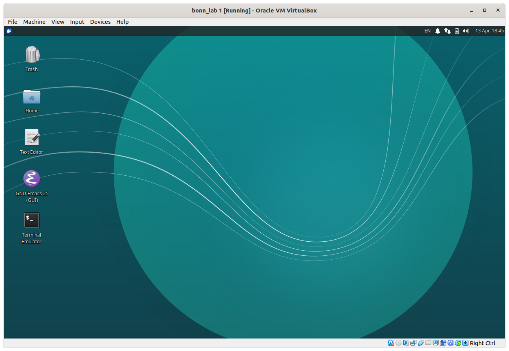

# Instructions for remote laboratory courses (ATLAS & Z0)

## Running the analysis software

People should ensure that everything works roughly a week in advance.

### Option 1: X-forwarding

Need instructions for linux-based, MacOS and Windows systems.

Linux: Should be straightforward.

MacOS: Install XQuartz?

Windows: ???

### Option 2: Virtual Machine

You can use a virtual machine (VM) as an alternative in case X-forwarding does
not work for you or your internet connection is too slow. We provide an
preconfigured 'appliance' that you can run using
[VirtualBox](https://www.virtualbox.org/). Please note that running a VM
requires a decent computer (and quite some disk space) therefore we suggest that
you try X-forwarding first but feel free to use this method if you have prior
experience with VMs.

To run the appliance need to download VirtualBox and install it on your
computer. VirtualBox is available for all major operating systems (e.g. Windows,
OS X, and Linux) on the [VirtualBox Downloads
page](https://www.virtualbox.org/wiki/Downloads).

You can download the ATLAS & Z0 appliance [here (4.6
GB)](https://uni-bonn.sciebo.de/s/t3IsIU8bMMWik7Q).

#### Setting up the appliance

The following instructions have been tested with VirtualBox 6.0.14 on a Linux
system. Some things might be named a little differently if you are running a
different version or operating system.

1. Start VirtualBox and go to `File > Import Appliance`
2. Select the appliance in `OVF` format that you downloaded from sciebo and click `Next`
3. The next window gives you the option to change the appliance settings. The
   defaults should be fine to use for the lab. Note that you can also change the
   directory where the VM is stored. Click `Import` after you are done changing
   the settings.
4. The appliance will show up in the VirtualBox Manager. Select it and press `Start`.
5. A window will show up with the graphical output of the VM.

#### Getting data off the VM

You can use any online file sharing service (e.g. sciebo, e-mail, ...) to get
the data you need for the report off the VM.

## Collaborating with your lab partner

Ways to talk & share your screen:
* DFN [link](https://www.conf.dfn.de/)
* Skype

### Using skype to collaborate with your lab partner
To install Skype, follow [link](https://www.skype.com/en/get-skype/download-skype-for-desktop/)

Keeping the fact that students and tutor have a Skype app already installed  on their respective devices/laptops and have a Skype account, the easiest way  to collaborate will be to create a Skype group with name of the chat group set as the group name, for e.g: “E213: PXX”.

a. The students should send in their Skype id’s to the tutor before the scheduled lab date, so that the tutor can make a Skype group and add both the students. The tutor will initiate the group call at the scheduled lab time, predecided by the students and the tutor, and will explain/ instruct the students about the lab course/ tasks that they have to perform on the day and any instructions in general. 

b. This skype group is only for collaboration/ discussion among the students while doing the lab course, for e.g. if the two students need to discuss something, share some plots etc. This can be effectively done via the screen sharing option whose symbol is displayed while doing a group call and of course they can send some plots etc. inside the normal chat also. 

For screen sharing: follow [link]( https://support.skype.com/en/faq/FA34895/screen-sharing-in-skype)

c. If the students also want the tutor to join the call, to report/ clarify or show them the progress, they can simply just leave a message on the group to notify the tutor so that they can join/ initiate the call on time (For this the tutors should be available online on Skype for most of the time during the day,  the lab is conducted).

d. The students should mutually agree between each other in presence of the tutor (before the actual lab session starts) about the tasks they want to split, so that they can simultaneously work on these tasks and discuss among each other or with the tutor as described in point b and c respectively.

e. To end the lab session for the day, the students can simply message the tutor for a group call and discuss the strategy for the next day.

### Using skype for oral exam:

a. The oral exam will be conducted separately for each student of the lab course (for a period of 30 minutes?).
The tutor will separately notify the students regarding their individual time slot.

b. The tutor  will contact the student on their respective time slot, and will conduct the oral exam. This will be via a video chat

c. To conduct a fair exam, the students should give a scan of the room/place they are sitting so as to ensure the tutor that no unforeseen cheating material is used...(while I know this does'nt make sense ;))

d. If the oral exam requires the student to draw something, they can use the Paint app (?), open it on their screens, start the screen sharing option and draw/represent accordingly whatever is asked by the tutor.

## Oral exam

Ways to sketch things (anything goes really, just some recommendations):
* [Xournal++](https://github.com/xournalpp/xournalpp)
* Paint?

##
